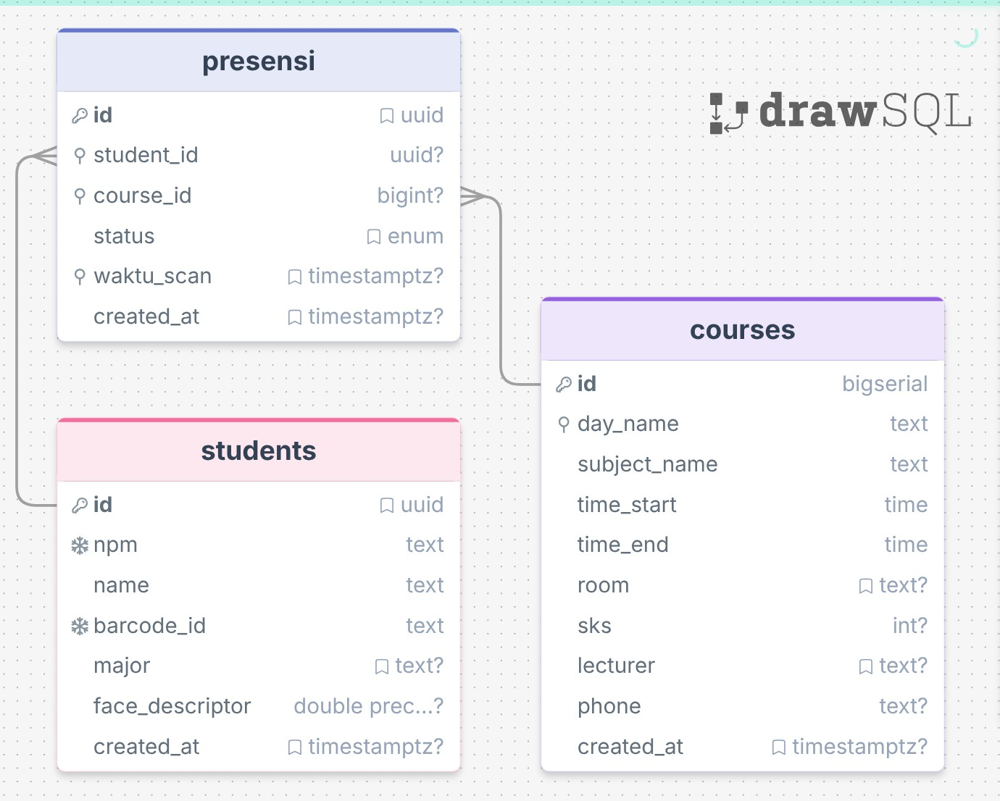

# 🎓 Si Perdi — Sistem Presensi Digital

**Si Perdi** adalah sistem manajemen kehadiran mahasiswa modern yang dirancang untuk efisiensi, akurasi, dan estetika. Nama **"Si Perdi"** merupakan singkatan kreatif dari **Sistem Presensi Digital**.

Aplikasi ini hadir sebagai solusi untuk menggantikan metode absensi manual yang lambat dan rentan kecurangan. Dengan mengombinasikan teknologi pemindaian biometrik wajah, kode batang (barcode), dan verifikasi lokasi GPS, Si Perdi memastikan setiap data kehadiran tercatat secara valid, real-time, dan terintegrasi langsung dengan jadwal perkuliahan.

---

## ✨ Fitur Utama

### 🔒 Keamanan & Validasi
- **📍 Geolocation Anti-Titip Absen**: Presensi hanya dapat dilakukan dalam radius **30 meter** dari titik koordinat kelas. Koordinat referensi ditentukan otomatis oleh mahasiswa pertama yang absen. Seluruh proses validasi berjalan diam-diam di latar belakang tanpa mengganggu pengalaman pengguna.
- **👤 Face Recognition Biometric**: AI mengenali wajah mahasiswa secara real-time untuk mencegah penitipan absen menggunakan foto atau orang lain.
- **🔢 Validasi Input**: NPM hanya dapat diisi angka, Nama hanya dapat diisi huruf — langsung tersaring saat pengetikan.
- **⏱️ Grace Period Otomatis**: Status Hadir/Terlambat dihitung otomatis dari jam mulai mata kuliah + 15 menit toleransi.

### 📷 Scanner & Registrasi
- **Dual-Mode Scanner (Face & Barcode)**: Mahasiswa dapat absen melalui pemindaian wajah atau barcode pada KTM.
- **High-Speed Barcode Scanner**: Stabilisasi kamera otomatis dengan algoritma adaptif untuk berbagai kondisi cahaya.
- **🧠 Neural OCR KTM Registration**: Daftarkan mahasiswa hanya dengan mengarahkan kamera ke KTM. Sistem mengekstrak NPM, Nama, dan Prodi secara otomatis menggunakan OCR berbasis AI.
- **🤳 Face ID Enrollment**: Proses pendaftaran biometrik wajah yang canggih dengan indikator progres dan panduan real-time.

### 📅 Jadwal & Laporan
- **Intelligent Schedule System**: Sistem mendeteksi mata kuliah aktif secara dinamis berdasarkan hari dan waktu real-time.
- **📊 Real-time Monitoring & Reporting**: Dashboard laporan dengan sinkronisasi otomatis. Filter canggih menggunakan sistem **Liquid Glass Modal** — pilih periode tanggal, mata kuliah, atau cari berdasarkan nama/NPM mahasiswa.
- **📄 Ultra-Compact PDF Export**: Cetak laporan berformat A4 yang bersih, termasuk statistik kehadiran, kolom NPM, dan area tanda tangan dosen.
- **🔢 Urutan Mata Kuliah Berdasarkan Hari**: Daftar filter mata kuliah diurutkan dari Senin hingga Minggu sesuai jadwal mingguan.

### 🎨 Desain & UX
- **Liquid Glass UI**: Antarmuka *glassmorphism* premium dengan `backdrop-blur`, gradien vibrasi, dan efek emboss pada tombol yang memberikan kesan modern dan eksklusif.
- **Premium Micro-animations**: Animasi transisi halus di setiap interaksi menggunakan kurva *cubic-bezier* yang dioptimalkan.
- **📳 Audio-Tactile Haptics**: Umpan balik getaran dan suara klik ala iOS di setiap interaksi penting.
- **📱 Progressive Web App (PWA) iOS**: Dapat diinstal ke layar utama iPhone/iPad, mendukung *standalone mode* untuk pengalaman aplikasi native.
- **🔄 Custom Scrollbar**: Scrollbar tersinkronisasi dengan warna tema aplikasi di semua elemen yang dapat di-scroll.
- **Responsive Design**: Tampilan dioptimalkan penuh untuk perangkat mobile (termasuk safe-area iPhone) hingga desktop.

---

## 🛠️ Tech Stack

| Teknologi | Peran |
|---|---|
| **React.js + Vite** | UI Framework & Build Tool |
| **Supabase (PostgreSQL)** | Database, Real-time Sync |
| **Vanilla CSS (Glassmorphism)** | Liquid Glass Design System |
| **Face-api.js** | Face detection & recognition (TensorFlow.js) |
| **Tesseract.js** | OCR untuk ekstraksi teks KTM |
| **Html5-QRCode** | Barcode scanner lintas platform |
| **Framer Motion** | Page & element transitions |
| **Lucide React** | Icon system |
| **Navigator Geolocation API** | Verifikasi lokasi presensi |

---

## 🗄️ Arsitektur Database

Si Perdi menggunakan struktur database relasional yang dioptimalkan untuk kecepatan kueri dan integritas data.

### Schema Diagram


### Detail Tabel & Relasi

**1. `students` — Master Data Mahasiswa**

| Kolom | Tipe | Keterangan |
|---|---|---|
| `id` | UUID | Primary Key |
| `npm` | TEXT UNIQUE | Nomor Pokok Mahasiswa |
| `name` | TEXT | Nama Lengkap |
| `barcode_id` | TEXT UNIQUE | ID dari barcode KTM |
| `major` | TEXT | Program Studi |
| `face_descriptor` | FLOAT8[] | Embedding wajah 128-dimensi |

**2. `courses` — Master Jadwal Kuliah**

| Kolom | Tipe | Keterangan |
|---|---|---|
| `id` | BIGINT | Primary Key |
| `day_name` | TEXT | Hari kuliah (Senin–Minggu) |
| `subject_name` | TEXT | Nama Mata Kuliah |
| `time_start` / `time_end` | TIME | Jam mulai dan selesai |
| `room` | TEXT | Ruangan kelas |
| `lecturer` | TEXT | Nama Dosen |
| `phone` | TEXT | WhatsApp Dosen (format 62...) |

**3. `presensi` — Log Transaksi Kehadiran**

| Kolom | Tipe | Keterangan |
|---|---|---|
| `id` | UUID | Primary Key |
| `student_id` | UUID FK | Relasi ke `students` |
| `course_id` | BIGINT FK | Relasi ke `courses` |
| `status` | TEXT | Hadir / Terlambat / Izin / Sakit / Alfa |
| `lat` | FLOAT8 | Latitude saat absen (background) |
| `lng` | FLOAT8 | Longitude saat absen (background) |
| `waktu_scan` | TIMESTAMPTZ | Waktu absen |

> **Logika Bisnis**: Status dihitung otomatis — jika `waktu_scan` > `time_start + 15 menit`, status menjadi *Terlambat*. Kolom `lat`/`lng` digunakan untuk validasi radius 30m secara senyap di latar belakang.

---

## ⚙️ Cara Instalasi

1. **Clone Repositori**:
   ```bash
   git clone https://github.com/wakhidpangestu/smartpresensi.git
   cd smartpresensi
   ```

2. **Install Dependensi**:
   ```bash
   npm install
   ```

3. **Konfigurasi Environment**:
   Buat file `.env` di root folder:
   ```env
   VITE_SUPABASE_URL=your_supabase_url
   VITE_SUPABASE_ANON_KEY=your_supabase_anon_key
   ```

4. **Setup Database**:
   Jalankan `supabase_schema.sql` di SQL Editor Supabase Anda.
   Atau tambahkan kolom geolokasi ke tabel yang sudah ada:
   ```sql
   ALTER TABLE public.presensi ADD COLUMN lat DOUBLE PRECISION;
   ALTER TABLE public.presensi ADD COLUMN lng DOUBLE PRECISION;
   ```

5. **Jalankan Mode Pengembangan**:
   ```bash
   npm run dev
   ```

---

## 👤 Kontributor

| Nama | Peran |
|---|---|
| **Wakhid Pangestu** | Product Manager & Full-Stack Developer |
| **Muhammad Fauzi Ihsan** | Graphic Designer |
| **Sophiatul Amalia** | QA Tester |
| **Alya Nur Tsabita** | IT Support |
| **Jasmine Romadhoni** | IT Support |

---

*Si Perdi — Smart Presence for a Smarter Campus.* ❤️
